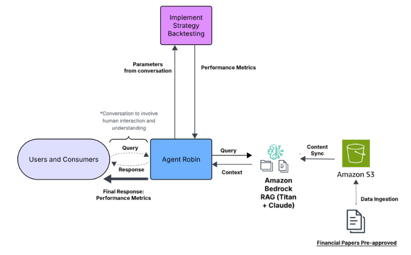
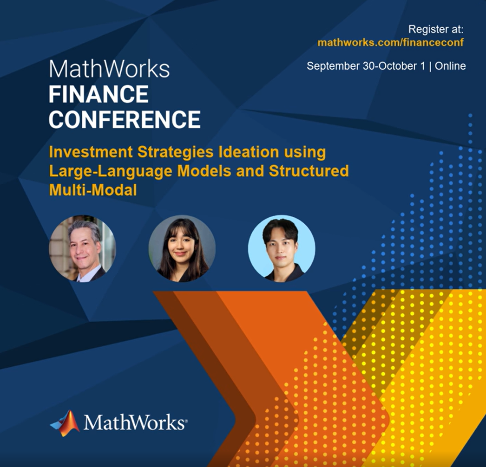
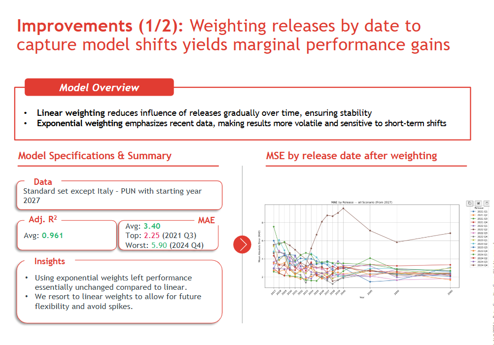
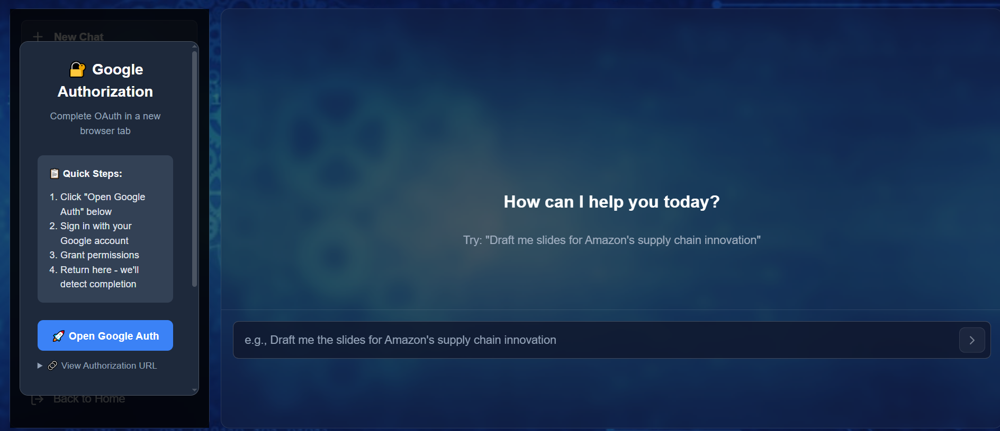
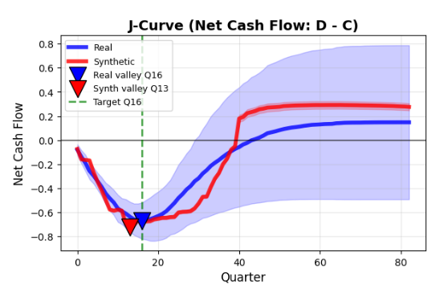
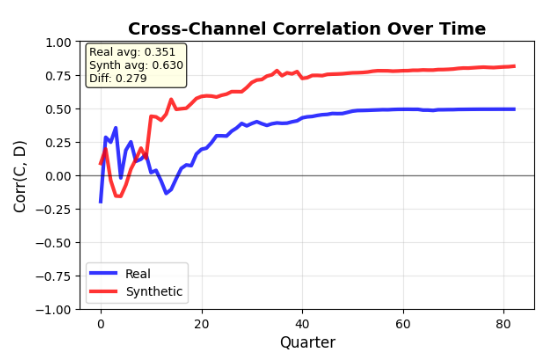
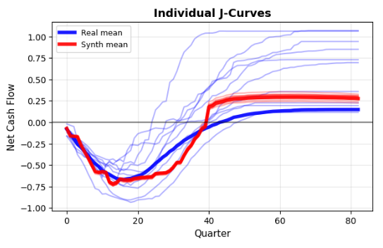
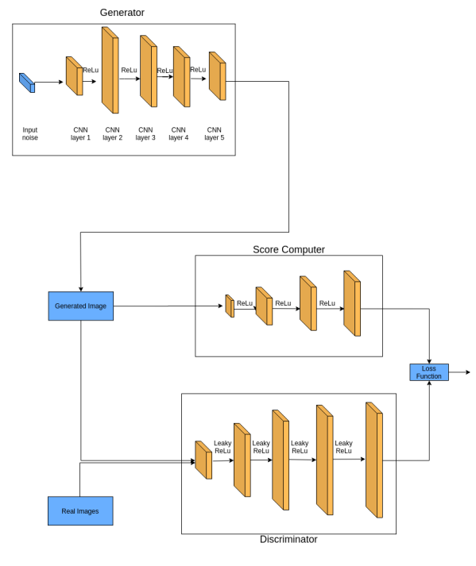
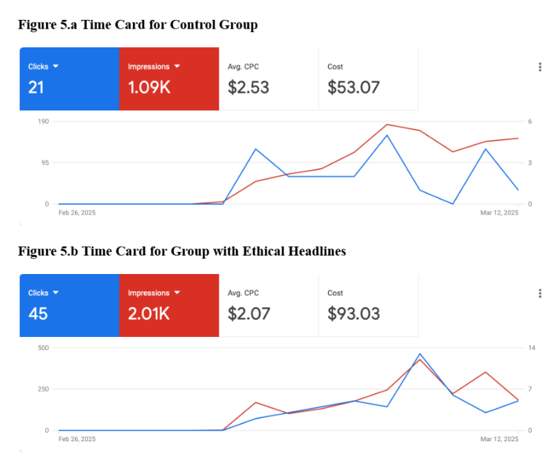
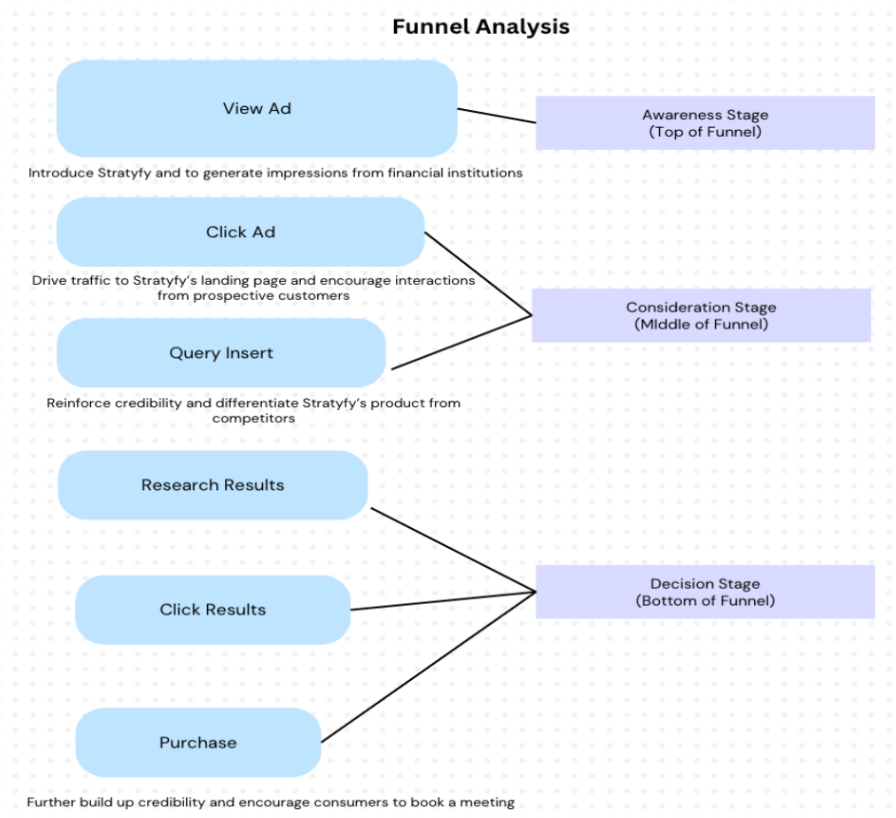

# Portfolio

I am an applied data scientist and AI engineer from Quito, Ecuador, fascinated by how advanced models become real systems that shape economies, infrastructure, and everyday decisions.

I have build production-grade AI systems that go from enterprise RAG pipelines and agentic workflows to large-scale forecasting engines, and that turn complex data into real operational and business impact. I care deeply about building models that are not only accurate, but auditable, scalable, and responsibly deployed, especially in areas like energy, sustainability, finance, and infrastructure where technology directly affects people's lives.

Curious by nature and driven by continuous learning, I am seeking Applied AI / ML Engineering and Quantitative Research roles in fintech, infrastructure analytics, and enterprise AI: across diverse industries where advanced models meet real people, real capital, and real-world consequences.

---

## Featured Projects

  <h3>🏆 AWS Bedrock Innovation Challenge Winner</h3>
  
Amazon Bedrock • Multi-Agent RAG • Lambda • OpenSearch • S3 • Real-Time Inference

  
<strong>Most Scalable Solution</strong> among 40+ engineering teams. Architected end-to-end agentic AI research-to-strategy system that transforms 1,000+ academic papers into executable trading algorithms across equities, crypto, and futures markets. Achieved >90% reduction in research-to-execution time with sub-second latency and near-linear scalability.

  

    
    
  

  

    🏆 Competition Winner
    <a href="assets/AWS_Bedrock_Presentation.pptx" download class="pill">📊 Presentation</a>
    🔒 Private Repository
  

  <h3>AI-Powered Investment Research Platform</h3>
  
LightRAG • Neo4j • ChromaDB • Sentence Transformers • LangChain • Python

  
Led team at Columbia Engineering's Quantitative Research Lab (MathWorks-sponsored) building investment ideation system. Presented with <strong>Professor Robbins at MathWorks Research Summit</strong>. Architected modular pipeline processing 3.41 GB of financial research, unifying 5,000+ papers and 20,000+ posts with semantic search. Reduced research time by >100 hours/month for portfolio managers.

  

    
  

  

    <a href="https://www.mathworks.com/videos/investment-strategies-ideation-using-large-language-models-and-structured-multi-modal-data-1760424545621.html" target="_blank" class="pill">🎥 MathWorks Presentation</a>
    🔒 Columbia IP
  

  <h3>30-Year Electricity Price Forecasting</h3>
  
Databricks • Apache Spark • RNN • XGBoost • Time Series • Feature Engineering

  
Built end-to-end forecasting system at Ardian (€150B AUM private equity) for European electricity markets. Preprocessed 1.5TB+ of market data across 10+ years and 20+ variables. Deployed RNN-XGBoost ensemble reducing forecast error by 21%, informing infrastructure investment decisions worth hundreds of millions.

  

    
  

  

    <a href="assets/ardianfinalpresentation.pdf" target="_blank" class="pill">📊 Final Presentation</a>
    🔒 Proprietary Data
  

  <h3>Full-Stack AI Automation for VC Tech Scouting</h3>
  
FastAPI • GPT-4 • PostgreSQL • React • Scrapy • Playwright • Google Slides API

  
Engineered complete AI system at Deep Venture Partners automating technology scouting across 25+ universities. Built microservices with FastAPI backend, React frontend, and multi-agent GPT-4 workflows for research analysis and automated presentation generation. Increased coverage from 50 to 300+ institutions while reducing memo time from 6 hours to 15 minutes.

  

    
    
    
  

  

    <a href="assets/reportdeepvp.pdf" target="_blank" class="pill">📄 Technical Report</a>
    🔒 Proprietary System
  

  <h3>Score-Regularized Bivariate GAN for PE Cash Flows</h3>
  
GANs • PyTorch • Financial Modeling • Curriculum Learning • Deep Learning

  
Master's thesis under Prof. Ali Hirsa (Columbia IEOR). Developed novel GAN architecture for private equity fund cash flow simulation with dual discriminators, hard negative training via frozen Score Machine classifier, and three-phase curriculum learning. Achieved realistic J-curve patterns matching real fund distributions for portfolio construction and stress testing.

  

    
    
    
    
  

  

    <a href="assets/Conference_Poster_Fall_2025_GANS.pptx" download class="pill">📊 Research Poster</a>
    📄 Thesis (NDA - Ask2.ai)
  

  <h3>A/B Testing & Marketing Attribution</h3>
  
Experimentation • Causal Inference • Statistical Modeling • ROI Analytics

  
Designed rigorous A/B testing strategy for Stratyfy (AI credit underwriting) comparing ethical vs. functional messaging for B2B financial services. Implemented randomized controlled trial with statistical power analysis. Reduced cost-per-click by 18%, achieved 2.10% CTR (vs 1.2% baseline), with 25% ROI improvement from downstream conversion quality.

  

    
    
  

  

    <a href="assets/Stratyfyfunnelanalysis.pdf" target="_blank" class="pill">📊 Funnel Analysis</a>
  

---

## Applied ML Projects & Coursework

  <h3>Cracking the Spotify Popularity Index</h3>
  
Machine Learning • NLP • Topic Modeling • Sentiment Analysis • LSA/LDA • Neural Networks

  
Comprehensive analysis predicting Spotify's popularity algorithm through regression analysis (Linear, Lasso, Random Forest) on audio features, genre classification, and stream data. Achieved R²=0.70 using neural network with audio feature extraction from YAMNet. Conducted sentiment analysis on song lyrics (2018-2023) revealing cultural trends. Compared topic similarity year-over-year using LSI, analyzed listener sentiment via YouTube comments using TextBlob and VADER. Case studies on Taylor Swift and Billie Eilish tracked stylistic evolution.

  

    <a href="assets/Final_Slides_Spotify_Popularity_Index_Project.pdf" target="_blank" class="pill">📊 Presentation</a>
  

  <h3>Capital Markets Case Study Analysis</h3>
  
Financial Analysis • Excel Modeling • Business Strategy • Quantitative Research

  
Applied quantitative research and financial modeling techniques learned in Capital Markets coursework. Analyzed market structures, valuation methodologies, and investment strategies through real-world case studies. Leveraged Excel for scenario analysis, sensitivity testing, and financial statement modeling to evaluate business decisions and market opportunities.

  

    <a href="assets/img/Case_5_mp4395.ipynb" target="_blank" class="pill">📓 Analysis Notebook</a>
  

  <h3>CupidAI: Emotional Intelligence for Dating Apps</h3>
  
GenAI • Multi-Agent Systems • LLM • Product Design • B2B SaaS

  
Designed agentic AI system addressing dating app engagement crisis (50% matches never message, 91% conversations die after 5 messages). Built compatibility scoring engine, conversation coaching AI, and personality inference system. Developed full business model with D2C→pilot→B2B SaaS GTM strategy including technical feasibility, risk mitigation, and revenue projections.

  

    <a href="assets/Dec2_AM_Group13.pdf" target="_blank" class="pill">📊 Business Plan</a>
    <a href="https://cupid-ai-insights.lovable.app/" target="_blank" class="pill">🎥 Live Demo</a>
  

  <h3>✨ More to Come!</h3>
  
Additional projects in development including advanced ML applications, data engineering pipelines, and business analytics case studies. Check back soon for updates!

---

## Technical Skills

**Machine Learning & AI**  
PyTorch, TensorFlow, Keras, Scikit-learn, LangChain, Sentence Transformers, Hugging Face, Generative AI (LLMs, GANs), NLP, Computer Vision, Time Series Forecasting, Transfer Learning

**Deep Learning Architectures**  
Transformers (BERT, GPT, T5), RNNs/LSTMs, CNNs (ResNet, VGG), GANs, VAEs, Attention Mechanisms, Graph Neural Networks

**Data Engineering & Infrastructure**  
Databricks, Apache Spark, PostgreSQL, ChromaDB, Neo4j, LightRAG, Vector Databases, ETL Pipelines, Data Modeling

**Cloud & MLOps**  
AWS (Bedrock, Lambda, S3, SageMaker, OpenSearch, EC2, DynamoDB, IAM), Docker, Git, FastAPI, RESTful APIs, OAuth2, Model Deployment, A/B Testing

**Programming & Analytics**  
Python (Pandas, NumPy, SciPy, Matplotlib, Seaborn), R, Julia, SQL, C++, Excel

**Experimentation & Statistics**  
A/B Testing, Causal Inference, Statistical Modeling, Hypothesis Testing, Bayesian Methods, Experimental Design

**Web Development**  
React, FastAPI, Playwright, Scrapy, Google APIs

---

## Experience

  <h3>Deep Venture Partners</h3>
  
Data Engineer | Jun - Aug 2025

  
Built full-stack AI automation for VC tech scouting with multi-agent workflows, real-time GPT-4 inference, and automated presentation generation across 25+ universities.

  <h3>Columbia Engineering | Quantitative Research Lab (MathWorks)</h3>
  
Project Manager & Data Scientist | Jun - Aug 2025

  
Led AI-powered investment ideation platform with Neo4j-ChromaDB graph database. Presented findings with Professor Robbins at MathWorks Research Summit. Reduced research time by >100 hours/month.

  <h3>Ardian</h3>
  
Data Scientist | Jan - May 2025

  
Developed 30-year electricity forecasting system using Databricks, RNN, and XGBoost on 1.5TB+ European market data.

  <h3>Ask2.ai</h3>
  
Data Scientist – Deep Learning Capstone Project | Sep - Dec 2025

  
Designed score-regularized bivariate Transformer-GAN to simulate private-equity cash-flow dynamics under extreme data scarcity (19 funds) using dual Wasserstein discriminators, hard-negative regularization, and nine domain-specific loss constraints to preserve J-curve shape; achieved accurate valley timing (Q13–19), high utility (0.958), and privacy (Wasserstein 0.059).

  <h3>Columbia University - IEOR Department</h3>
  
Course Assistant, IEOR E4101 Probability Statistics & Simulation | Sep - Dec 2025

  
Selected by IEOR faculty based on academic performance and technical interviews to support core probability & statistics course. Proctored and graded exams and assignments while supporting course administration and mentoring students in statistical modeling.

  <h3>Stratyfy</h3>
  
Digital Marketing Freelancer | Jan - Mar 2025

  
Designed A/B testing strategy with causal inference, reducing CPC by 18% and achieving 2.10% CTR.

  <h3>✨ More to Come!</h3>
  
Additional experience and opportunities in development. Stay tuned for updates!

---

## Education

**Columbia University** — MS in Business Analytics, GPA: 3.66/4.00 | *Dec 2025*

*Coursework:* Artificial Intelligence/Deep Learning, Applied Machine Learning, Optimization, Digital Marketing, Marketing Analytics, Probability & Statistics, Capital Markets

**École Polytechnique Paris** — BS in Mathematics & Economics, GPA: 3.58/4.00 | *Jun 2024*

*Coursework:* Machine Learning Theory, Convex Optimization, Asymptotic Statistics, Real Analysis, Econometrics

---

## Awards

**AWS Bedrock Innovation Challenge Winner** — *Nov 2025*  
Most Scalable Solution among 40+ teams. Recognized for secure RAG grounding, verifiable citations, and >10× efficiency gains.

---

*Many projects developed under NDA or in private repositories. Technical documentation and architecture diagrams available upon request.*